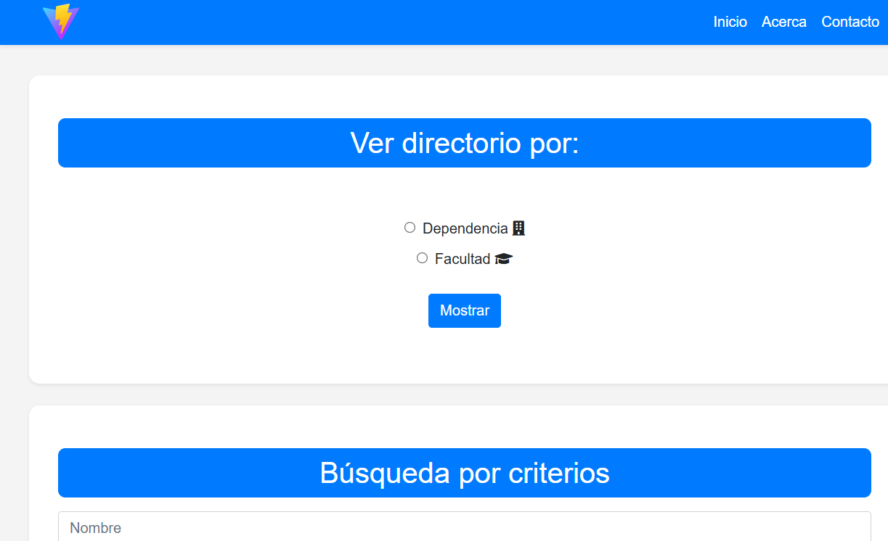

# WEB Directorio

## 📞 Directorio Telefónico

Aplicación web desarrollada para facilitar la búsqueda y visualización de contactos telefónicos por **facultad**, **dependencia** o mediante criterios personalizados como nombre, apellido o anexo.

---

## 🚀 Tecnologías usadas

- HTML5
- CSS3 / Bootstrap 4.5
- JavaScript (modular)
- [Vite](https://vitejs.dev/) como herramienta de desarrollo
- Font Awesome para íconos
- XLSX.js (para manejar archivos Excel en el futuro)

---

## 📷 Vista previa

---

## 🧪 Scripts disponibles

En el directorio del proyecto, puedes correr:

### `npm install`

Instala las dependencias del proyecto. Requerido antes de ejecutar el proyecto por primera vez.

### `npm run dev`

Levanta el servidor de desarrollo con **Vite**. Ideal para desarrollo local.

URL por defecto: [http://localhost:5173](http://localhost:5173)

### `npm run build`

Crea una versión optimizada para producción en la carpeta `dist/`.

### `npm run preview`

Sirve la versión de producción localmente para pruebas finales.

---

## 📦 Requisitos

- Node.js ≥ 18
- Navegador moderno (Chrome, Firefox, etc.)

---

## 📚 Funcionalidades

- Búsqueda por **dependencia** o **facultad**
- Filtros por **nombre**, **apellido** y **anexo**
- Visualización tabular responsive
- Botón para imprimir resultados
- Interfaz amigable con Bootstrap

---

## 📝 Licencia

Este proyecto está bajo la licencia MIT.
